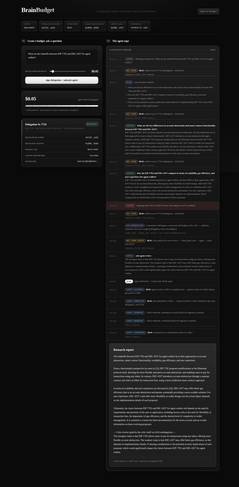
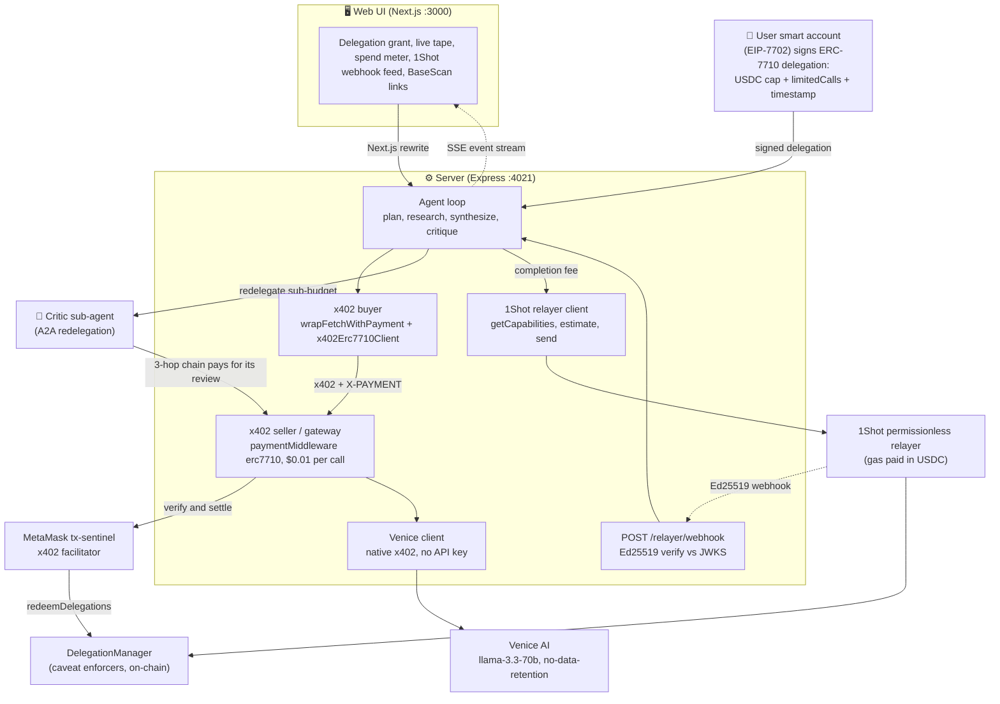
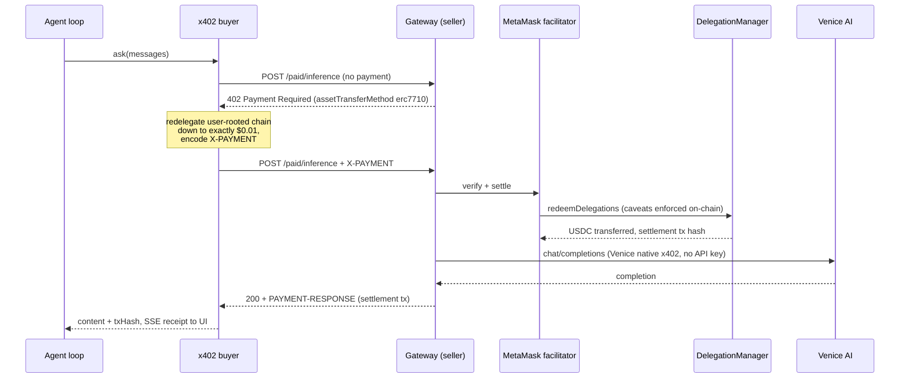
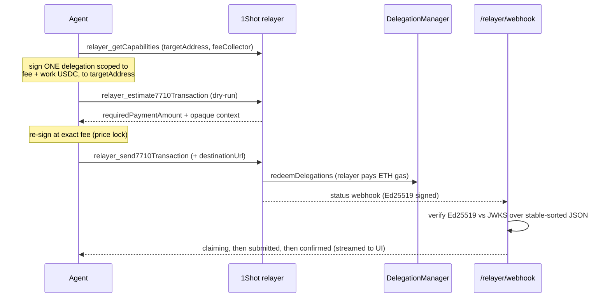
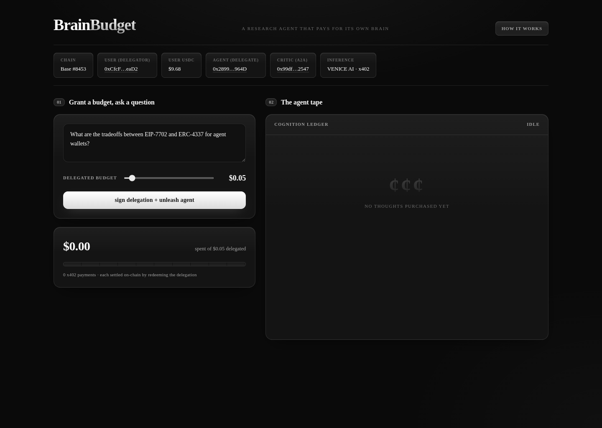
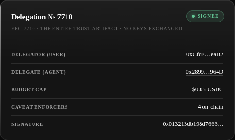
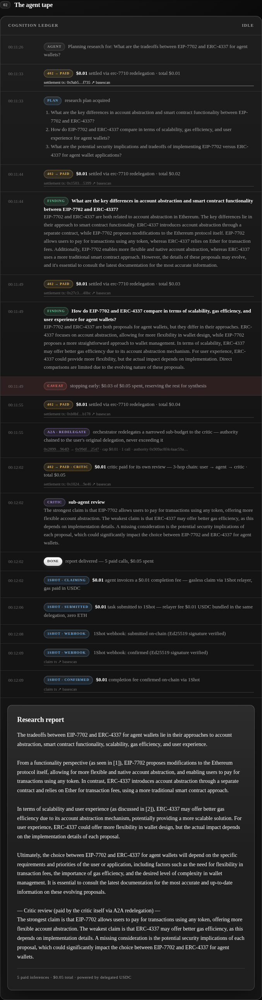
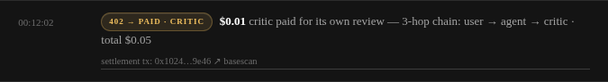
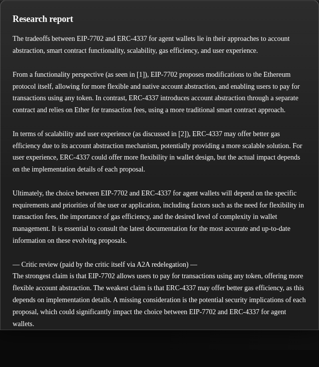

# BrainBudget — the AI agent that pays for its own brain

> **Delegation, not custody.** An autonomous research agent that buys its own Venice AI inference, one signed x402 micropayment at a time, under a scoped ERC‑7710 delegation you can revoke — relayed gaslessly by 1Shot, **live on Base mainnet with zero ETH in any account.**

<p>
 
 
 
 

</p>



---

## Table of contents

1. [What is BrainBudget?](#1-what-is-brainbudget)
2. [How it works (the user's view)](#2-how-it-works-the-users-view)
3. [Architecture](#3-architecture)
4. [Technical implementation — proof of code](#4-technical-implementation--proof-of-code)
5. [Networks & key addresses](#5-networks--key-addresses)
6. [Repo layout & top‑view explanation](#6-repo-layout--top-view-explanation)
7. [Live on Base mainnet — verifiable (and the Base Sepolia special case)](#7-live-on-base-mainnet--verifiable-and-the-base-sepolia-special-case)
8. [Demo walkthrough (screenshots + verifiable transactions)](#8-demo-walkthrough-screenshots--verifiable-transactions)
9. [Run it yourself](#9-run-it-yourself)
10. [Scripts reference](#10-scripts-reference)
11. [What we'd build next](#11-what-wed-build-next)
12. [Developer experience & feedback](#12-developer-experience--feedback)
---

## 1. What is BrainBudget?

BrainBudget is an **autonomous AI research agent that has no API keys and no custody of your money.** You answer a question by granting the agent a small, scoped, revocable **on‑chain budget** — a MetaMask **ERC‑7710 delegation** signed from your smart account. The agent then researches your question by **paying per request for its own Venice AI inference over x402**, where every single LLM call is an on‑chain‑enforceable USDC micropayment authorized by your delegation, **relayed gaslessly through the 1Shot permissionless relayer**, with a live spend‑vs‑budget meter and receipts you can verify on BaseScan.

### The problem it solves

AI agents need spending power to be useful. But the two things people do today are both broken:

| Today's "agent wallet" | What goes wrong |
|---|---|
| Give the agent a **private key / seed phrase** | That's **custody** — the agent (or whoever compromises it) can drain everything. |
| Give the agent a **credit card / API key** | Same problem one layer up: unbounded, hard to revoke, leaks into logs. |
| **Approve every action manually** | Then it isn't autonomous — you're the bottleneck. |

BrainBudget's answer is the third option that didn't exist before smart‑account delegation: **scoped delegation.** The user stays fully self‑custodial. The agent receives a *delegation* — a signed, on‑chain‑enforceable permission with **caveats**: *spend at most $X USDC, in at most N calls, expiring in 24h, only through this payment route.* The MetaMask Delegation Framework's **caveat enforcers reject anything outside that scope at the contract level** — not by trusting the agent's code. The delegation fails **closed**.

### Use cases

- **Pay‑per‑use AI agents** that can't be over‑charged: budget is a cap, not a credential.
- **Agent marketplaces / tool calling** where every paid tool is an x402 resource and the buyer's authority is a revocable delegation.
- **Multi‑agent teams** (orchestrator → specialists) where each sub‑agent gets a *strictly smaller* slice of the parent's budget via redelegation.
- **Gasless onboarding** of brand‑new wallets that hold only USDC (no ETH) — the EIP‑7702 upgrade itself is relayed and paid in stablecoin.
- **Privacy‑preserving research** — inference runs on Venice's no‑data‑retention layer, paid anonymously by wallet signature rather than an account/API key.

### How to use it effectively

1. Fund a **user** wallet with a little USDC (the demo uses ~$10) and a **gateway** wallet with ~$5 (one‑time Venice top‑up). **No ETH anywhere.**
2. Set the **budget slider** to the maximum you're willing to let the agent spend on a single question. That number *is* the delegation cap — the agent can never exceed it, even if its code is buggy or hostile.
3. Ask a research question and watch the cognition ledger: each thought is a paid call, each payment is a BaseScan link, the meter ticks toward your cap, and when the cap is reached the agent **stops gracefully** (or, if it tries to overspend, the caveat enforcer rejects it on‑chain).
4. For multi‑agent depth, leave the **critic** configured: you'll see the orchestrator hand a narrowed sub‑budget to a second agent that pays for its own review.

---

## 2. How it works (the user's view)

1. **Fund** — the app upgrades a burner EOA into a MetaMask smart account via **EIP‑7702** (`Implementation.Stateless7702` — the MetaMask x402 facilitator requires 7702‑upgraded EOAs as delegators), holding USDC on Base. Headless/embedded by design; the Smart Accounts Kit is signer‑agnostic, so the same flow works with the MetaMask extension, Embedded Wallets, Dynamic, or Privy.
2. **Delegate** — one click grants the agent a delegation: a **USDC transfer‑amount scope** (the spend cap) + **limited‑calls** caveat + **timestamp** (expiry) caveat. The signed delegation JSON is displayed — *this is the entire trust artifact; no keys change hands.*
3. **Ask** — type a research question.
4. **Watch it work** — the agent plans, then runs research steps. Each step is a paid x402 request: the UI shows the `402 → paid` receipt, the delegation‑backed settlement, and the Venice response.
5. **Spend meter** — a live budget bar tracks every cent against the cap, with BaseScan links to each settlement.
6. **Budget‑aware autonomy** — the agent reserves budget for synthesis (and the critic), stopping research early rather than blowing the whole budget on intermediate queries. If a payment *is* attempted over‑budget, it's **rejected on‑chain by the caveat enforcer** and the agent stops gracefully.
7. **A2A review** — before delivering, the orchestrator **redelegates** a narrowed sub‑budget to a critic sub‑agent. The critic pays for its *own* review inference through the 3‑hop chain `user → agent → critic` — authority cryptographically chained to your original grant, never exceeding it.
8. **Result** — a synthesized report with the critic's review appended, plus a receipt: total spent, calls made, budget remaining.
9. **The agent invoices you** — a small completion fee, claimed **gaslessly via the 1Shot relayer** (relayer fee paid in USDC inside the same delegation bundle; zero ETH). Status streams live: `claiming → submitted → confirmed`, each webhook **Ed25519‑verified**, with the BaseScan link.

---

## 3. Architecture

### Two flavors of x402 in one pipeline (and why the gateway exists)

x402 settles payments in different ways. Venice's native x402 endpoint uses **standard settlement** (EIP‑3009‑style transfer authorization) — great, but it doesn't exercise delegations. The official spec extension `assetTransferMethod: "erc7710"` settles via **delegation redemption** instead: the payment header carries an ERC‑7710 delegation payload and the facilitator redeems it on the DelegationManager. BrainBudget demonstrates **both, end to end**:

- **Agent → Gateway:** every inference request is an x402 payment settled by **redeeming the user's delegation** (the `@metamask/x402` erc7710 scheme, MetaMask facilitator). *This is what makes the agent non‑custodial.*
- **Gateway → Venice:** the gateway's own wallet pays Venice through Venice's **native x402** top‑up flow — wallet‑signature auth, **zero API keys anywhere.**

### Component diagram



### Sequence: one paid inference call (`402 → pay → 200`)



### Sequence: gasless completion‑fee relay via 1Shot



---

## 4. Technical implementation — proof of code

Every claim below links to the exact lines that back it. The stack is `@metamask/smart-accounts-kit` v1.6, `@metamask/x402` v0.2 (`@x402/*` v2 SDK), `venice-x402-client`, and the 1Shot JSON‑RPC relayer.

### 4.1 Smart accounts & chain config — `packages/shared`

A burner EOA is upgraded **in place** into a MetaMask smart account via EIP‑7702 — the exact shape the MetaMask x402 facilitator requires for ERC‑7710 delegators.

**Wrap a burner EOA as an EIP‑7702 smart account** — [`packages/shared/src/accounts.ts` L59–L69](packages/shared/src/accounts.ts#L59-L69)

```ts
export async function makeSmartAccount7702(
  publicClient: PublicClient,
  owner: Account,
): Promise<MetaMaskSmartAccount> {
  return toMetaMaskSmartAccount({
    client: publicClient,
    implementation: Implementation.Stateless7702,
    address: owner.address,
    signer: { account: owner },
  });
}
```

> `Implementation.Stateless7702` with the owner's own address means the smart account **is** the EOA upgraded in place, not a fresh counterfactual contract. This is the linchpin of the x402+7710 flow.

**Sign a 7702 authorization the 1Shot relayer can submit (owner needs zero ETH)** — [`packages/shared/src/accounts.ts` L120–L150](packages/shared/src/accounts.ts#L120-L150)

```ts
export async function build7702AuthorizationEntry(opts: {
  publicClient: PublicClient;
  owner: Account;
  chainId: number;
  delegatorImpl: `0x${string}`;
}): Promise<AuthorizationEntry | undefined> {
  const expectedCode = `0xef0100${opts.delegatorImpl.slice(2).toLowerCase()}`;
  const code = await opts.publicClient.getCode({ address: opts.owner.address });
  if (code?.toLowerCase() === expectedCode) return undefined;
  // ...
  const auth = await opts.owner.signAuthorization({
    chainId: opts.chainId,
    contractAddress: opts.delegatorImpl,
    nonce,
  });
  return { address: auth.address, chainId: auth.chainId, nonce: auth.nonce,
           r: auth.r, s: auth.s, yParity: auth.yParity ?? 0 };
}
```

> Produces a plain‑JSON EIP‑7702 authorization that a third party (the 1Shot relayer) submits on the owner's behalf — so the owner EOA **never needs ETH**. The `0xef0100 + impl` code check no‑ops when the EOA already runs the delegator.

**Single source of truth for both chains** — [`packages/shared/src/chains.ts` L17–L42](packages/shared/src/chains.ts#L17-L42)

```ts
export const CHAINS: Record<SupportedChainKey, ChainConfig> = {
  base: {
    chain: base,
    usdc: "0x833589fCD6eDb6E08f4c7C32D4f71b54bdA02913",
    facilitatorUrls: [
      "https://tx-sentinel-base-mainnet.dev-api.cx.metamask.io/platform/v2/x402",
      "https://tx-sentinel-base-mainnet.api.cx.metamask.io/platform/v2/x402",
    ],
    oneShotRelayerUrl: "https://relayer.1shotapi.com/relayers",
    explorerTxUrl: (hash) => `https://basescan.org/tx/${hash}`,
  },
  baseSepolia: { /* …Sepolia USDC, .dev relayer, test facilitator… */ },
};
```

> Flipping `CHAIN=base` ↔ `CHAIN=baseSepolia` switches USDC, the MetaMask facilitator, and the 1Shot relayer endpoint with **no code edits** — the identical agent runs live on Base mainnet.

> **Gotcha worth flagging:** when the authorizing EOA submits its own type‑4 tx, the authorization nonce must be bumped past the tx nonce (`executor: "self"`) or the upgrade is *silently skipped* — handled in [`ensure7702Upgraded` L75–L103](packages/shared/src/accounts.ts#L75-L103).

### 4.2 ERC‑7710 delegation & A2A redelegation — `packages/shared/src/delegation.ts`

This is the **non‑custodial trust core**. The user signs one artifact that caps spend, call count, and lifetime; agents can spend autonomously but can **mathematically never exceed** what the user authorized.

**The user‑signed budget delegation** — [`packages/shared/src/delegation.ts` L36–L56](packages/shared/src/delegation.ts#L36-L56)

```ts
const delegation = createDelegation({
  to: params.to,
  from: params.delegator.address,
  environment: params.delegator.environment,
  scope: {
    type: ScopeType.Erc20TransferAmount,
    tokenAddress: params.usdc,
    maxAmount: parseUnits(params.maxUsdc, 6),
  },
  caveats: [
    { type: CaveatType.LimitedCalls, limit: params.maxCalls },
    { type: CaveatType.Timestamp, afterThreshold: 0,
      beforeThreshold: now + params.validForSeconds },
  ],
});
const signature = await params.delegator.signDelegation({ delegation });
```

> `ScopeType.Erc20TransferAmount` enforces a total USDC ceiling; `LimitedCalls` and `Timestamp` bound *how many times* and *for how long*. `signDelegation` is the **only** place the user's key is involved — everything afterward is autonomous. (In the UI this compiles to the **4 on‑chain caveat enforcers** shown on the delegation card.)

**A2A: a narrowed sub‑delegation chained to the parent** — [`packages/shared/src/delegation.ts` L84–L106](packages/shared/src/delegation.ts#L84-L106)

```ts
const delegation = createDelegation({
  to: params.to,
  from: params.delegator.address,
  environment: params.delegator.environment,
  parentDelegation: params.parentDelegation,
  salt: `0x${/* random 32 bytes */}`,
  scope: { type: ScopeType.Erc20TransferAmount, tokenAddress: params.usdc,
           maxAmount: parseUnits(params.maxUsdc, 6) },
  caveats: [
    { type: CaveatType.LimitedCalls, limit: params.maxCalls },
    { type: CaveatType.Timestamp, afterThreshold: 0,
      beforeThreshold: now + params.validForSeconds },
  ],
});
const signature = await params.delegator.signDelegation({ delegation });
```

> The agent (itself the delegate of the parent) mints a fresh sub‑delegation whose authority is `hash(parent)` via `parentDelegation`, re‑applying its own *narrower* caveats. Because the chain only redeems if **every hop's caveats pass**, the sub‑agent can never exceed the original grant.

**Leaf‑first redemption through the DelegationManager** — [`packages/shared/src/delegation.ts` L116–L127](packages/shared/src/delegation.ts#L116-L127)

```ts
const transferCalldata = encodeFunctionData({
  abi: erc20Abi, functionName: "transfer",
  args: [recipient, parseUnits(amountUsdc, 6)],
});
const executions = [createExecution({ target: usdc, callData: transferCalldata })];
return DelegationManager.encode.redeemDelegations({
  delegations: [[signedDelegation]],
  // Several caveats are incompatible with batch modes (workshop gotcha) — always SingleDefault.
  modes: [ExecutionMode.SingleDefault],
  executions: [executions],
});
```

> Redemption encodes a standard ERC‑20 transfer and runs through `redeemDelegations`, which walks the chain and enforces every caveat **on‑chain before executing**. `ExecutionMode.SingleDefault` is mandatory — several caveats break under batch modes. This is where off‑chain signed authority becomes an on‑chain payment.

### 4.3 x402 buyer — `server/src/buyer.ts`

The agent‑side payment layer. On a 402, it redelegates the user‑rooted chain down to exactly the required amount and hands it to the facilitator. **No agent ever holds the user's funds.**

**The integration surface** — [`server/src/buyer.ts` L1–L7](server/src/buyer.ts#L1-L7)

```ts
import { x402Client, x402HTTPClient } from "@x402/core/client";
import { wrapFetchWithPayment } from "@x402/fetch";
import { x402Erc7710Client } from "@metamask/x402";
import { createx402DelegationProvider } from "@metamask/smart-accounts-kit/experimental";
import { encodeDelegations } from "@metamask/smart-accounts-kit/utils";
```

**Wire the delegation chain into a payment‑aware `fetch`** — [`server/src/buyer.ts` L43–L52](server/src/buyer.ts#L43-L52)

```ts
const erc7710Client = new x402Erc7710Client({
  delegationProvider: createx402DelegationProvider({
    account: opts.agentSmartAccount,
    parentPermissionContext: encodeDelegations(opts.delegationChain),
  }),
});
const coreClient = new x402Client().register("eip155:*", erc7710Client);
const httpClient = new x402HTTPClient(coreClient);
const fetchWithPayment = wrapFetchWithPayment(fetch, httpClient);
```

> The agent's smart account + the encoded user‑rooted chain (`parentPermissionContext`) feed `createx402DelegationProvider`; wrapping `fetch` yields a drop‑in `fetch` that transparently satisfies any 402. **This is the exact line where a signed ERC‑7710 delegation becomes the `X-PAYMENT` authorization.** The *only* difference between the orchestrator paying (2 hops) and the critic paying (3 hops) is the length of `delegationChain`.

**Capture the on‑chain settlement tx** — [`server/src/buyer.ts` L54–L67](server/src/buyer.ts#L54-L67)

```ts
return async (input, init) => {
  const response = await fetchWithPayment(input, init);
  const paymentResponse = response.headers.get("PAYMENT-RESPONSE") ?? undefined;
  if (paymentResponse) {
    opts.onPayment?.({
      at: new Date().toISOString(),
      url: /* … */, status: response.status, paymentResponse,
      txHash: decodeSettlementTx(paymentResponse),
    });
  }
  return response;
};
```

> Decodes the facilitator's base64 `PAYMENT-RESPONSE` into a real settlement tx hash per request — closing the loop *delegation → X‑PAYMENT → relayed settlement → on‑chain proof* that powers the BaseScan links in the UI.

### 4.4 x402 seller / inference gateway — `server/src/gateway.ts`

The paid resource server: a Venice inference endpoint behind an x402 paywall whose **only** accepted payment is redeeming an ERC‑7710 delegation.

**Resource server wired to the MetaMask facilitator + erc7710 scheme** — [`server/src/gateway.ts` L28–L32](server/src/gateway.ts#L28-L32)

```ts
const facilitatorClient = new HTTPFacilitatorClient({ url: facilitatorUrl });
const resourceServer = new x402ResourceServer(facilitatorClient).register(
  networkId,
  new x402ExactEvmErc7710ServerScheme(),
);
```

**A $0.01 route payable only via ERC‑7710** — [`server/src/gateway.ts` L37–L49](server/src/gateway.ts#L37-L49)

```ts
"POST /paid/inference": {
  accepts: [
    {
      scheme: "exact",
      price: INFERENCE_PRICE,
      network: networkId,
      payTo,
      extra: { assetTransferMethod: "erc7710" },
    },
  ],
  description: "One Venice AI inference request, paid via delegated USDC",
  mimeType: "application/json",
},
```

> `extra.assetTransferMethod: "erc7710"` is what *forces* payment to come from **redeeming the agent's delegation chain** rather than a plain wallet transfer. Reaching the handler at all proves the `402 → pay → 200` lifecycle completed; the settlement tx is read off `PAYMENT-RESPONSE` and the body is proxied to Venice ([L55–L67](server/src/gateway.ts#L55-L67)). Verify/settle is entirely middleware‑driven — the route handler contains *no* payment logic.

### 4.5 Venice AI inference (native x402, no API key) — `server/src/venice.ts`

100% of inference is Venice, paid by wallet signature — **there is no Venice API key anywhere in the stack.**

**Wallet‑key‑only client with x402 auto top‑up** — [`server/src/venice.ts` L23–L28](server/src/venice.ts#L23-L28)

```ts
function getVenice(): VeniceClient {
  veniceClient ??= new VeniceClient(process.env.GATEWAY_PRIVATE_KEY!, {
    autoTopUp: { enabled: true, amount: 5 },
  });
  return veniceClient;
}
```

**OpenAI‑compatible call; live balance surfaced; honest `mocked` flag** — [`server/src/venice.ts` L44–L57](server/src/venice.ts#L44-L57)

```ts
const venice = getVenice();
const response = await venice.chat({
  model: request.model ?? MODEL,        // default "llama-3.3-70b"
  messages: request.messages,
  max_tokens: request.max_tokens ?? 800,
  temperature: request.temperature ?? 0.3,
});
return {
  content: response.choices[0]?.message.content ?? "",
  model: request.model ?? MODEL,
  usage: response.usage,
  veniceBalanceUsd: venice.balance,
  mocked: false,
};
```

> The client authenticates with a **wallet private key alone** and `autoTopUp` settles a USDC x402 payment to refill credit when low — inference is genuinely self‑funding. `venice.balance` is surfaced to the UI as `veniceBalanceUsd`, and `mocked: false` certifies a real paid inference. `VENICE_MOCK=1` ([L30–L43](server/src/venice.ts#L30-L43)) keeps the **payment real** while stubbing tokens, so the paywall can be exercised on testnet.

### 4.6 1Shot permissionless relayer (gasless, gas in USDC) — `server/src/relayer.ts`

Executes the agent's USDC micropayment **without ever holding ETH** via the 1Shot JSON‑RPC relayer.

**One delegation, fee + work both transferred in USDC** — [`server/src/relayer.ts` L98–L131](server/src/relayer.ts#L98-L131)

```ts
const buildAndSign = async (feeAmount: bigint) => {
  const delegation = createDelegation({
    to: caps.targetAddress,
    from: opts.userSmartAccount.address,
    environment: opts.userSmartAccount.environment,
    salt: bytesToHex(Uint8Array.from(randomBytes(32))) as `0x${string}`,
    scope: { type: ScopeType.Erc20TransferAmount, tokenAddress: usdc.address,
             maxAmount: feeAmount + workAmount },
  });
  const signature = await opts.userSmartAccount.signDelegation({ delegation });
  const signedDelegation = { ...delegation, signature };
  const executions = [
    { target: usdc.address, value: "0",
      data: encodeFunctionData({ abi: erc20Abi, functionName: "transfer",
                                 args: [caps.feeCollector, feeAmount] }) },
    // …plus the work transfer…
  ];
};
```

**Estimate‑first price lock → dry‑run gate → gasless send with webhook** — [`server/src/relayer.ts` L141–L165](server/src/relayer.ts#L141-L165)

```ts
let feeAmount = parseUnits("0.01", 6);            // estimate at the $0.01 floor
let params = await buildAndSign(feeAmount);
const estimate = await rpc<Estimate7710Result>("relayer_estimate7710Transaction", params);
if (!estimate.success) throw new Error(`relayer estimate failed: ${estimate.error}`);

const required = BigInt(estimate.requiredPaymentAmount ?? feeAmount);
if (required !== feeAmount) { feeAmount = required; params = await buildAndSign(feeAmount); }

// Dry run: relayer has verified the signed delegation + simulated both transfers.
if (opts.dryRun) return { taskId: "dry-run", feeUsdcAtoms: feeAmount.toString(), targetAddress: caps.targetAddress };

const taskId = await rpc<string>("relayer_send7710Transaction", {
  ...params,
  context: estimate.context,
  ...(opts.webhookUrl ? { destinationUrl: opts.webhookUrl } : {}),
  ...(opts.memo ? { memo: opts.memo } : {}),
});
```

> It re‑signs the delegation at the relayer's *real* `requiredPaymentAmount` so the bundle is **price‑locked**, replays the opaque `context` into the broadcast, and supports a **read‑only `dryRun`** that fully validates against the live relayer with no funds moving. Gas is reimbursed to the relayer in USDC; the user never touches ETH.

**Ed25519 webhook verification over stable‑sorted JSON** — [`server/src/relayer.ts` L230–L243](server/src/relayer.ts#L230-L243)

```ts
export async function verifyRelayerWebhook(
  body: Record<string, unknown>, jwksOverride?: Jwk[],
): Promise<boolean> {
  const { signature, ...rest } = body;
  const keyId = (body as { keyId?: string }).keyId;
  if (typeof signature !== "string") return false;
  const keys = jwksOverride ?? (await getJwks());
  const jwk = (keyId ? keys.find((k) => k.kid === keyId) : keys[0]) ?? keys[0];
  if (!jwk?.x) return false;
  const publicKey = createPublicKey({ key: { kty: "OKP", crv: "Ed25519", x: jwk.x }, format: "jwk" });
  const payload = Buffer.from(stableStringify(rest), "utf8");
  return edVerify(null, payload, publicKey, Buffer.from(signature, "base64"));
}
```

> Inbound status callbacks are authenticated by canonicalizing the body with a recursive **key‑sorted** `stableStringify` and verifying the base64 Ed25519 signature against the relayer's published **JWKS**. The stable sort is essential — Ed25519 signs exact bytes, so any key reordering would break verification. This proves a callback genuinely came from 1Shot and wasn't forged. ([`webhook-verify-test.ts`](server/scripts/webhook-verify-test.ts) asserts it accepts genuine and rejects tampered envelopes.)

### 4.7 Autonomous agent loop (budget‑aware) — `server/src/agent/loop.ts`

`plan → N research queries → synthesis → A2A critique`, where every LLM call is a paid x402 micropayment and a raw `402` means the **on‑chain caveat enforcer** said no.

**Every reasoning step buys inference through the x402 paid fetch** — [`server/src/agent/loop.ts` L117–L138](server/src/agent/loop.ts#L117-L138)

```ts
const paidFetch = makePaidFetch({
  agentSmartAccount: opts.agentSmartAccount,
  delegationChain: [opts.userDelegation],
  onPayment: onPayment("orchestrator"),
});

const askVia = (fetcher) => async (messages) => {
  const response = await fetcher(opts.inferenceUrl, {
    method: "POST",
    headers: { "Content-Type": "application/json" },
    body: JSON.stringify({ messages }),
  });
  if (response.status === 402) {
    throw new BudgetExhausted("payment rejected by the caveat enforcer (budget or call limit reached)");
  }
  if (!response.ok) throw new Error(`inference failed: HTTP ${response.status}`);
  return ((await response.json()) as { content: string }).content;
};
const ask = askVia(paidFetch);
```

> A raw HTTP 402 here means the **on‑chain caveat enforcer rejected the payment** — proving the budget guard is enforced on‑chain, not just in JS, and converting it into a recoverable `BudgetExhausted` signal.

**Budget‑aware stopping with calls reserved for synthesis + critic** — [`server/src/agent/loop.ts` L140–L173](server/src/agent/loop.ts#L140-L173)

```ts
const hasBudgetFor = (upcomingCalls: number) =>
  spentUsd + upcomingCalls * PRICE_USD <= opts.budgetUsd + 1e-9;
// …
// reserve 1 call for synthesis, +1 for the critic when A2A is available
const reserved = opts.criticSmartAccount ? 3 : 2;
for (const query of queries) {
  if (!hasBudgetFor(reserved)) { /* stop early, keep budget for synthesis */ }
  // …
}
```

> `hasBudgetFor` projects spend forward before each paid call and **reserves** the calls needed to finish coherently. (In the live run, this fired the `stopping early: $0.03 of $0.05 spent, reserving the rest for synthesis` event after 2 of 3 research steps.)

**A2A: orchestrator redelegates so the critic pays for itself** — [`server/src/agent/loop.ts` L222–L260](server/src/agent/loop.ts#L222-L260)

```ts
const subDelegation = await createSubDelegation({
  to: opts.criticSmartAccount.address,
  delegator: opts.agentSmartAccount,
  parentDelegation: opts.userDelegation,
  usdc: chainConfig.usdc,
  maxUsdc: PRICE_USD.toFixed(6),
  maxCalls: 1,
  validForSeconds: 3600,
});
emit(run, { type: "a2a", /* … */, authority: hashDelegation(opts.userDelegation),
  message: "orchestrator redelegates a narrowed sub-budget to the critic — authority chained to the user's original delegation, never exceeding it" });
const criticAsk = askVia(
  makePaidFetch({
    agentSmartAccount: opts.criticSmartAccount,
    delegationChain: [subDelegation, opts.userDelegation],   // 3-hop, leaf-first
    onPayment: onPayment("critic"),
  }),
);
```

> The critic pays with **its own** smart account through the chain `[subDelegation, userDelegation]`. The `hashDelegation(userDelegation)` authority field proves the critic's spending power is cryptographically chained to — and bounded by — the user's original delegation.

### 4.8 Server wiring, config & env — `server/src/index.ts`, `config.ts`, `env.ts`

**`POST /research`: 7702‑upgrade all actors, then mint the scoped budget delegation** — [`server/src/index.ts` L59–L83](server/src/index.ts#L59-L83)

```ts
const delegatorImpl =
  actors.userSmartAccount.environment.implementations.EIP7702StatelessDeleGatorImpl;
const owners = [actors.userEoa, actors.agentEoa, actors.criticEoa].filter(Boolean);
for (const owner of owners) {
  await ensure7702Upgraded({ publicClient, owner, submitter: actors.agentWallet,
    chain: chainConfig.chain, delegatorImpl });
}
const userDelegation = await createBudgetDelegation({
  to: actors.agentSmartAccount.address,
  delegator: actors.userSmartAccount,
  usdc: chainConfig.usdc,
  maxUsdc: budgetUsd.toFixed(6),
  maxCalls,
  validForSeconds: 24 * 3600,
});
```

> The entry point (default budget **0.05 USDC / 10 calls**, [L47–L57](server/src/index.ts#L47-L57)) ensures every delegator is 7702‑upgraded (idempotent — a no‑op once onboarded), then has the user grant the agent its scoped budget. The run then streams over SSE via [`GET /research/:id/events`].

**The webhook gate Ed25519‑verifies before trusting anything** — [`server/src/index.ts` L138–L152](server/src/index.ts#L138-L152)

```ts
app.post("/relayer/webhook", async (req, res) => {
  const body = req.body as Record<string, unknown>;
  if (!(await verifyRelayerWebhook(body))) {
    res.status(401).json({ error: "Ed25519 signature verification failed" });
    return;
  }
  const matched = handleRelayerWebhook(body);
  res.json({ ok: true, matched });
});
```

> A forged webhook is rejected with `401`; only verified callbacks advance the run state. The `GET /state` route ([L27–L45](server/src/index.ts#L27-L45)) reports live balances with `.catch(() => null)` fallbacks (so a transient RPC blip shows `—` instead of crashing the demo) and a `veniceMocked` flag. Actors are built once and memoized in [`config.ts getActors()` L33–L57](server/src/config.ts#L33-L57); the optional critic exists only when `CRITIC_PRIVATE_KEY` is set.

### 4.9 Web UI (Next.js) — `web/app/page.tsx`, `web/next.config.ts`

The headless agent made watchable: one click signs the delegation and streams a live "cognition ledger."

**One click: POST grants the delegation, SSE streams the spend** — [`web/app/page.tsx` L109–L137](web/app/page.tsx#L109-L137)

```tsx
const response = await fetch("/api/agent/research", {
  method: "POST",
  headers: { "Content-Type": "application/json" },
  body: JSON.stringify({ question, budgetUsd: budget }),
});
const { runId, delegation: signed, error } = await response.json();
if (error) throw new Error(error);
setDelegation(signed);
const source = new EventSource(`/api/agent/research/${runId}/events`);
source.onmessage = (message) => {
  const event = JSON.parse(message.data) as AgentEvent;
  setEvents((prev) => [...prev, event]);
};
source.addEventListener("done", () => { source.close(); setRunning(false); });
```

**x402 receipts with BaseScan settlement links** — [`web/app/page.tsx` L377–L406](web/app/page.tsx#L377-L406)

```tsx
{event.type === "payment" && (
  <>
    <span className="badge">402 → paid{event.actor === "critic" ? " · critic" : ""}</span>
    <span className="amount">$0.01</span>
    <span className="body">
      {event.actor === "critic"
        ? "critic paid for its own review — 3-hop chain: user → agent → critic"
        : "settled via erc-7710 redelegation"} · total ${event.spentUsd.toFixed(2)}
    </span>
    {event.payment.txHash && explorer && (
      <a className="settle tx-link" href={`${explorer}${event.payment.txHash}`} target="_blank" rel="noreferrer">
        settlement tx: {short(event.payment.txHash)} ↗ basescan
      </a>
    )}
  </>
)}
```

**Rewrites keep the browser secret‑free** — [`web/next.config.ts` L4–L11](web/next.config.ts#L4-L11)

```ts
async rewrites() {
  return [
    {
      source: "/api/agent/:path*",
      destination: `${process.env.SERVER_URL ?? "http://localhost:4021"}/:path*`,
    },
  ];
}
```

> All frontend calls proxy to the Express server, so the client bundle ships **no keys, RPC URLs, or facilitator config** — and the same UI works against localhost or mainnet. The delegation signing and x402 settlement happen entirely server‑side; the client only consumes a typed SSE stream.

---

## 5. Networks & key addresses

| Thing | Value |
|---|---|
| **Demo chain** | **Base mainnet `8453`** (Venice x402 is mainnet‑only) |
| Dev chain | Base Sepolia `84532` (free: faucet USDC, 1Shot `.dev` relayer, test facilitator) |
| USDC (Base) | [`0x833589fCD6eDb6E08f4c7C32D4f71b54bdA02913`](https://basescan.org/address/0x833589fCD6eDb6E08f4c7C32D4f71b54bdA02913) |
| USDC (Base Sepolia) | `0x036CbD53842c5426634e7929541eC2318f3dCF7e` |
| MetaMask facilitator (Base) | `https://tx-sentinel-base-mainnet.dev-api.cx.metamask.io/platform/v2/x402` |
| MetaMask facilitator (Base Sepolia) | `https://tx-sentinel-base-sepolia.dev-api.cx.metamask.io/platform/v2/x402` |
| 1Shot relayer (mainnet / dev) | `https://relayer.1shotapi.com/relayers` / `https://relayer.1shotapi.dev/relayers` |
| 1Shot delegation target (Base) | `0x26a529124f0bbf9af9d8f9f84a43efe47cf1199a` |
| Venice API | `https://api.venice.ai/api/v1` (OpenAI‑compatible, model `llama-3.3-70b`) |

### Live demo accounts (Base mainnet — public, verifiable)

These four EOAs were upgraded to EIP‑7702 smart accounts and run the live demo. Every onboarding and every payment is traceable from these addresses on BaseScan:

| Role | Address |
|---|---|
| **User** (delegator) | [`0xCfcFaF3787850C989035f348F9FAdf8c2A3deaD2`](https://basescan.org/address/0xCfcFaF3787850C989035f348F9FAdf8c2A3deaD2) |
| **Agent** (delegate / orchestrator) | [`0x2899334B59624dc554994375329D16004E1a964D`](https://basescan.org/address/0x2899334B59624dc554994375329D16004E1a964D) |
| **Critic** (A2A sub‑agent) | [`0x99df9265a194A607bBd2d51Edc18e73D5Bb82547`](https://basescan.org/address/0x99df9265a194A607bBd2d51Edc18e73D5Bb82547) |
| **Gateway** (Venice x402 payer) | [`0x1f550242630340E021EeF4237110a51c933C1c5D`](https://basescan.org/address/0x1f550242630340E021EeF4237110a51c933C1c5D) |

---

## 6. Repo layout & top‑view explanation

BrainBudget is a **pnpm workspace monorepo** (`web`, `server`, `packages/*`). Setup is intentionally trustless and disposable: 3–4 **burner private keys** in `.env`, one `CHAIN` switch, and **no Venice API key** (inference is paid on‑chain).

```
brainbudget/
├── web/                         Next.js UI (:3000)
│   ├── app/page.tsx             delegation grant · live tape · spend meter · webhook feed · BaseScan links
│   ├── app/layout.tsx           shell + global styles
│   └── next.config.ts           rewrites /api/agent/* → Express server (keeps client secret-free)
│
├── server/                      Express (:4021): x402 gateway + agent runtime + 1Shot webhook receiver
│   ├── src/index.ts             routes: POST /research, GET /research/:id/events (SSE),
│   │                            POST /relayer/webhook (Ed25519), GET /state, GET /health
│   ├── src/config.ts            lazy, memoized 7702 smart accounts for user/agent/critic
│   ├── src/env.ts               loads the root .env
│   ├── src/buyer.ts             x402 buyer — agent pays per request via ERC-7710 delegation
│   ├── src/gateway.ts           x402 seller — $0.01 paywalled Venice route (assetTransferMethod: erc7710)
│   ├── src/venice.ts            Venice native-x402 client (no API key, auto top-up)
│   ├── src/relayer.ts           1Shot JSON-RPC client + Ed25519 webhook verification
│   ├── src/agent/loop.ts        the autonomous plan→research→synthesize→critique loop
│   └── scripts/                 proof harness + ops tooling (see §11)
│
├── packages/shared/             smart-account / delegation / chain-config helpers shared by web & server
│   └── src/{accounts,delegation,chains,index}.ts
│
├── docs/
│   ├── screenshots/             the demo screenshots embedded in this README
│   └── vendor/                  pinned upstream docs (smart-accounts-kit-full.txt, 1Shot relayer skill)
├── reference/x402-7710-demo/    workshop reference implementation
│
├── Dockerfile                   single image that runs web + server together (mirrors `pnpm dev`)
├── docker-compose.yml           one-command setup: `docker compose up --build` (mounts root .env)
├── .dockerignore                keeps node_modules, build output, and secrets out of the image
└── README.md                    
```

**Data flow in one sentence:** the browser POSTs a question + budget through a Next.js rewrite to the Express server, which 7702‑upgrades the actors, signs an ERC‑7710 budget delegation, and runs the agent loop — whose every inference call is an x402 payment redeeming that delegation through the MetaMask facilitator, proxied to Venice, with the completion fee relayed gaslessly by 1Shot and the whole thing streamed back over SSE.

---

## 7. Live on Base mainnet — verifiable (and the Base Sepolia special case)

### Base mainnet — the real demo (verify everything below on BaseScan)

The run captured in this README was executed on **Base mainnet (chain `8453`)** on **2026‑06‑15** with real USDC and **zero ETH in any account**. Question: *"What are the tradeoffs between EIP‑7702 and ERC‑4337 for agent wallets?"*, **$0.05** delegated budget. The agent spent **exactly $0.05 across 5 x402 + ERC‑7710 payments** (plan + 2 research steps + synthesis + the A2A critic), stopped its research early to reserve budget for synthesis, then invoiced its completion fee via 1Shot. Real Venice throughout (`llama-3.3-70b`, `mocked: false`).

**On‑chain settlements — this exact run:**

| # | Step | Amount | BaseScan |
|---|---|---|---|
| 1 | x402 + ERC‑7710 inference — **plan** | $0.01 | [`0x9ab5357a…f735`](https://basescan.org/tx/0x9ab5357ae8c6540b032fa477f8bf1d331b3bbeda893a4eba1eaad81c7031f735) |
| 2 | x402 + ERC‑7710 inference — **research 1** | $0.01 | [`0x150314e6…5399`](https://basescan.org/tx/0x150314e6502a31bc8b0805b9056d6e0bd7a84bc8724ef8c36cdf1c2eea655399) |
| 3 | x402 + ERC‑7710 inference — **research 2** | $0.01 | [`0x27c35078…40bc`](https://basescan.org/tx/0x27c350784551ac1f82fe147b6a132988565edfd448ffc7bd1e0cf0e79bf540bc) |
| 4 | x402 + ERC‑7710 inference — **synthesis** | $0.01 | [`0xb8bf87f5…b178`](https://basescan.org/tx/0xb8bf87f5be051435789d25128aa43dfaf1d687a90aca71b129ede054362db178) |
| 5 | **A2A 3‑hop** — critic pays for its own review (`user → agent → critic`) | $0.01 | [`0x10246eab…9e46`](https://basescan.org/tx/0x10246eab5d55f9418850ee57b07468b938531e3365f2e44bbcace72be42f9e46) |
| 6 | **1Shot completion fee** — `redeemDelegations` relayed gaslessly, fee in USDC, Ed25519 webhook `submitted → confirmed` | $0.01 | [`0x8cb06954…2fdf`](https://basescan.org/tx/0x8cb06954bb86ab6a05d9e0dae4a07de9dee05b114b238123e3d7149596322fdf) |

**Zero‑ETH onboarding (one‑time, permanent on‑chain) — the EIP‑7702 upgrades, all relayed gaslessly with the fee paid in USDC:**

| Step | BaseScan |
|---|---|
| user EOA → EIP‑7702 delegator | [`0x270236e1…a8f69`](https://basescan.org/tx/0x270236e178622eef5aeb3ef26bfafc99915fe3330c9456ae5e16256c175a8f69) |
| agent EOA → EIP‑7702 delegator | [`0x4a074690…4c5d5`](https://basescan.org/tx/0x4a07469041ad94f678c320f648c10922ba25e4e31535486d65d675da24a4c5d5) |
| critic EOA → EIP‑7702 delegator | [`0xc5fef4bd…a0e376`](https://basescan.org/tx/0xc5fef4bd8624c9c3666dfbe099ab5421dfddbe735f4e6614c73534ae71a0e376) |

> The 1Shot status webhook was delivered to a public tunnel of `POST /relayer/webhook`, **Ed25519‑verified against the relayer's JWKS**, and streamed into the live run tape (not polling). Reproduce with §10 — [`server/scripts/bootstrap-mainnet.ts`](server/scripts/bootstrap-mainnet.ts) performs the one‑time gasless onboarding.

### Base Sepolia — (a small case)

Venice's x402 endpoint is **mainnet‑only**, so the *real* inference demo must run on Base mainnet. But the **delegation lifecycle and the on‑chain caveat rejection** are proven on **Base Sepolia** via [`pnpm demo:e2e`](server/scripts/e2e.ts):

**The over‑budget redemption MUST revert on‑chain** — [`server/scripts/e2e.ts` L97–L113](server/scripts/e2e.ts#L97-L113)

```ts
// 4. over-budget redemption must fail (caveat enforcer, on-chain)
try {
  await redeemAsEoaTransfer({ /* … */ amountUsdc: OVER_BUDGET_USDC });
  throw new Error("OVER-BUDGET REDEMPTION WAS NOT REJECTED — caveat not enforced!");
} catch (error) {
  const message = (error as Error).message;
  if (message.includes("NOT REJECTED")) throw error;
  console.log(`\n✓ over-budget redemption (${OVER_BUDGET_USDC} USDC > ${BUDGET_USDC} cap) rejected on-chain, as designed`);
}
```

> The e2e signs a 2‑USDC budget delegation, redeems a 0.05‑USDC tranche, and then asserts that a **3‑USDC over‑budget redemption is rejected on‑chain by the caveat enforcer** — treating a *non*‑rejection as a hard test failure. This is the load‑bearing security claim: the agent's spend is bounded by cryptographic delegation, not app‑layer trust. On mainnet the same guard surfaces as the budget‑aware graceful stop and a `402` from the caveat enforcer. `VENICE_MOCK=1` keeps x402 payments real while stubbing tokens so the paywall path can be exercised on Sepolia ([`x402-e2e.ts`](server/scripts/x402-e2e.ts)).

---

## 8. Demo walkthrough (screenshots + verifiable transactions)

All screenshots are from the live **Base mainnet** run in §7. (Re‑capture at 1440px viewport; full‑resolution PNGs are in [`docs/screenshots/`](docs/screenshots/).)

### 1 — Initial state: grant a budget, ask a question

The header shows the chain (**Base #8453**), the user/agent/critic addresses (all BaseScan‑linked), live user USDC, and the inference provider (**VENICE AI · x402**). The budget slider *is* the delegation cap.



### 2 — The signed ERC‑7710 delegation: the entire trust artifact

One click signs the delegation. The card is the proof that authority was granted via a **verifiable artifact, not a private key**: delegator, delegate, the **$0.05 USDC cap**, **4 on‑chain caveat enforcers**, and the signature.



### 3 — The agent tape: every thought is a paid x402 call

The "cognition ledger" streams live over SSE. Each `402 → paid` receipt links to its on‑chain settlement on BaseScan; the spend meter ticks toward $0.05; and note the budget‑aware `stopping early: $0.03 of $0.05 spent, reserving the rest for synthesis` event — the agent governing its own budget.



### 4 — A2A: the orchestrator redelegates a narrowed sub‑budget to the critic

`agent 0x2899…964D → critic 0x99df…2547 · cap $0.01 · 1 call · authority 0x909ac8f4…` — the critic's authority is cryptographically chained to (and bounded by) the user's original delegation.


### 5 — The critic pays for its own review (3‑hop chain)

`402 → paid · critic` — the critic settles its own inference through `user → agent → critic`. Verifiable on‑chain: [`0x10246eab…9e46`](https://basescan.org/tx/0x10246eab5d55f9418850ee57b07468b938531e3365f2e44bbcace72be42f9e46).



### 6 — The 1Shot completion fee, confirmed on‑chain (gasless)

The agent invoices a $0.01 completion fee, claimed gaslessly via the 1Shot relayer (fee in USDC, zero ETH). Status streamed `claiming → submitted → confirmed`, each webhook **Ed25519‑verified**. Claim tx: [`0x8cb06954…2fdf`](https://basescan.org/tx/0x8cb06954bb86ab6a05d9e0dae4a07de9dee05b114b238123e3d7149596322fdf).


### 7 — The result: synthesized report + critic review + receipt

A cited report with the critic's review appended, and the receipt: **5 paid inferences · $0.05 total · powered by delegated USDC**.



---

## 9. Run it yourself

```bash
pnpm install
cp .env.example .env        # fill in burner private keys (user, agent, gateway, critic)
pnpm demo:e2e               # Base Sepolia: sign delegation → redeem a tranche → over-budget redemption rejected on-chain
pnpm dev                    # web UI on :3000, server on :4021
```

### …or with Docker (no local Node/pnpm needed)

The repo ships a `Dockerfile` + `docker-compose.yml` that run **both** the web UI (:3000) and the server (:4021) in one container — the same as `pnpm dev`. You only need Docker installed and a filled-in root `.env`.

```bash
cp .env.example .env        # fill in burner private keys (user, agent, gateway, critic)
docker compose up --build   # web UI on :3000, server on :4021
```

The `.env` is injected and mounted read-only, so you can edit keys and restart without rebuilding. Prefer raw Docker? `docker build -t brainbudget . && docker run --rm -p 3000:3000 -p 4021:4021 --env-file .env -v "$PWD/.env:/app/.env:ro" brainbudget`.

### `.env` (no Venice API key — inference is paid on‑chain)

| Variable | Purpose |
|---|---|
| `CHAIN` | `base` (mainnet demo) or `baseSepolia` (free dev) |
| `USER_PRIVATE_KEY` | delegator (funded with USDC) |
| `AGENT_PRIVATE_KEY` | delegate / orchestrator |
| `GATEWAY_PRIVATE_KEY` | pays Venice via x402 (funded with USDC) |
| `CRITIC_PRIVATE_KEY` | optional — enables A2A coordination |
| `BASE_RPC_URL` / `BASE_SEPOLIA_RPC_URL` | optional private RPC overrides |
| `SERVER_PORT` / `SERVER_URL` | server port + UI proxy target |
| `RELAYER_WEBHOOK_URL` | public tunnel of `POST /relayer/webhook` (empty → falls back to polling) |
| `VENICE_MODEL` | default `llama-3.3-70b` |

### Base Sepolia (free)
ETH from any Base Sepolia faucet, test USDC from [Circle's faucet](https://faucet.circle.com/). Set `CHAIN=baseSepolia`.

### Base mainnet (the real demo)
Fund the **user** EOA with ~$10 USDC and the **gateway** EOA with ~$5 USDC. **No ETH to anything.** Then:

```bash
# 1. point at mainnet:  .env → CHAIN=base
# 2. one-time gasless onboarding — upgrades user/agent/critic EOAs to EIP-7702 delegators
#    through 1Shot, fee paid in USDC, zero ETH:
pnpm --filter server script scripts/bootstrap-mainnet.ts
#    (BOOTSTRAP_DRY_RUN=1 prices the first hop against the live relayer without moving funds)
# 3. (optional, scores higher) expose the 1Shot webhook receiver:
ngrok http 4021            # then .env → RELAYER_WEBHOOK_URL=https://<id>.ngrok-free.app/relayer/webhook
# 4. run the demo
pnpm dev                   # UI on :3000, server on :4021
```

> A full run burns **well under $1** — Venice is ~$0.002/request, 1Shot ~$0.01/tx, and the x402 inference USDC recycles into your own gateway wallet. If `RELAYER_WEBHOOK_URL` is unset the agent falls back to status polling (the demo still works; you lose the live webhook tape). **Emergency exit:** [`server/scripts/recover.ts`](server/scripts/recover.ts) sweeps any account's USDC back to a wallet you control, gaslessly — even from a zero‑ETH EOA.

---

## 10. Scripts reference

Run any with `pnpm --filter server script scripts/<name>.ts`. Read‑only scripts move **no funds**.

| Script | What it does |
|---|---|
| [`e2e.ts`](server/scripts/e2e.ts) | **`pnpm demo:e2e`** — full ERC‑7710 lifecycle on Sepolia incl. on‑chain rejection of an over‑budget redemption. |
| [`bootstrap-mainnet.ts`](server/scripts/bootstrap-mainnet.ts) | One‑time gasless EIP‑7702 onboarding of the `.env` accounts via the 1Shot relayer (chained, fee in USDC, zero ETH). |
| [`recover.ts`](server/scripts/recover.ts) | Emergency gasless USDC sweep from any account back to a wallet you control (bundles the 7702 upgrade if needed). |
| [`addresses.ts`](server/scripts/addresses.ts) | Prints every address that needs funding (incl. counterfactual smart accounts). |
| [`balances.ts`](server/scripts/balances.ts) | Prints ETH + USDC balances for user/agent/gateway/critic on the configured chain. |
| [`gen-keys.ts`](server/scripts/gen-keys.ts) | Generates fresh burner keypairs for `.env`. |
| [`venice-probe.ts`](server/scripts/venice-probe.ts) | Read‑only probe of gateway USDC + Venice credit + suggested top‑up (no auto top‑up). |
| [`venice-test.ts`](server/scripts/venice-test.ts) | Isolated real‑Venice inference test through `runInference` (first call auto‑tops‑up $5). |
| [`verify-recovery.ts`](server/scripts/verify-recovery.ts) | Read‑only pre‑funding safety check — confirms keys derive to funded addresses, reports 7702 state on both chains. |
| [`webhook-verify-test.ts`](server/scripts/webhook-verify-test.ts) | Signs a synthetic 1Shot webhook and asserts `verifyRelayerWebhook` accepts genuine / rejects tampered envelopes. |
| [`relayer-7702-e2e.ts`](server/scripts/relayer-7702-e2e.ts) | Gasless onboarding e2e for three fresh zero‑ETH burners chained through the relayer. |
| [`relayer-e2e.ts`](server/scripts/relayer-e2e.ts) | Agent claims a USDC tranche through the 1Shot relayer with zero ETH. |
| [`x402-e2e.ts`](server/scripts/x402-e2e.ts) | Agent pays the x402 gateway via an ERC‑7710 redelegation chain, settled by the MetaMask facilitator. |
| [`x402-debug.ts`](server/scripts/x402-debug.ts) | Inspects 402 payment requirements and manually steps the buyer to isolate failures. |
| [`migrate-funds.ts`](server/scripts/migrate-funds.ts) | One‑off: moves USDC out of the old Hybrid user smart account to the user EOA. |

---

## 11. What we'd build next

- **ERC‑7715 `wallet_grantPermissions`** so any MetaMask user can grant the budget from the extension UI (the headless flow is signer‑agnostic, so this is a drop‑in).
- **Delegation revocation button** — an instant agent kill‑switch.
- **A marketplace of erc7710‑x402‑paywalled tools** (search, scraping, code‑exec) any delegated agent can pay for.
- **Deeper redelegation chains** — multi‑agent teams with per‑role budgets.
- **A custom Solidity caveat enforcer** (e.g. "only whitelisted resource servers" / "only during market hours") to showcase the framework's composability.

---

## 12. Developer experience & feedback

See [`docs/others/FEEDBACK.md`](docs/others/FEEDBACK.md) for detailed DX notes, API gotchas, and wins encountered while building BrainBudget with `@metamask/smart-accounts-kit` v1.6.x and `@metamask/x402` v0.2.x. Includes doc inconsistencies, runtime surprises, and the 1Shot relayer integration quirks — filed to help future builders ship faster.